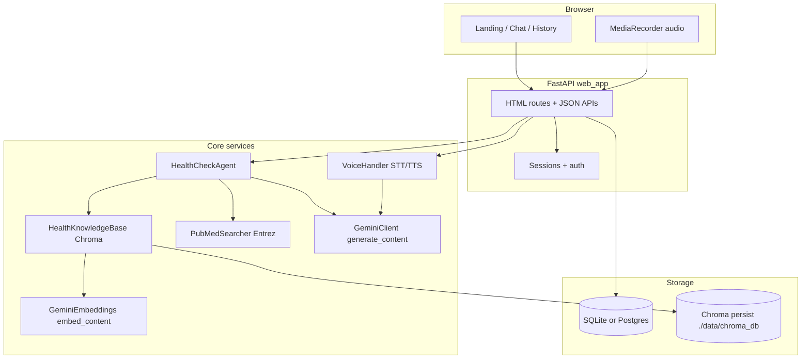

# MedVer — Health claim verification system

MedVer helps people **verify viral health claims**—especially myths common in Nigeria—using a **curated knowledge base**, **semantic search (RAG)**, optional **PubMed** abstracts, and **Google Gemini** for explanations. The primary interface is a **FastAPI web app** with a conversational chat UI, browser microphone capture, and optional text-to-speech replies.

This document explains **how the system works end-to-end** for operators and developers.

---

## Table of contents

1. [What users experience](#what-users-experience)
2. [High-level architecture](#high-level-architecture)
3. [Core concepts](#core-concepts)
4. [End-to-end request flows](#end-to-end-request-flows)
5. [Verification pipeline (RAG + Gemini)](#verification-pipeline-rag--gemini)
6. [Voice pipeline](#voice-pipeline)
7. [Data layer](#data-layer)
8. [Authentication and sessions](#authentication-and-sessions)
9. [Admin curated truths](#admin-curated-truths)
10. [HTTP routes and APIs](#http-routes-and-apis)
11. [Configuration (environment variables)](#configuration-environment-variables)
12. [Project layout](#project-layout)
13. [Running locally](#running-locally)
14. [Deploying (e.g. Render)](#deploying-eg-render)
15. [Limitations and safety](#limitations-and-safety)

---

## What users experience

| Area | Behavior |
|------|----------|
| **Landing** (`/`) | Public marketing/overview; links to sign-in or registration. |
| **Account** | Users **register** (email, password, optional display name) or **sign in**. Sessions use signed cookies (`SessionMiddleware`). |
| **Chat** (`/chat`) | Requires login. User types a claim or uses the **mic** (browser `MediaRecorder` → audio uploaded). Reply shows verdict-style labeling extracted from the model output; optional **read aloud** (TTS). |
| **Language toolbar** | UI selects language for voice/TTS routing (`English`, `Pidgin`, `Yoruba`, `Hausa`, `Igbo`); transcription/output mappings live in `voice_handler.py`. |
| **History** (`/history`) | Requires login. Lists saved checks for the current user’s **history label** (display name if set, else email). |
| **About** (`/about`) | Safety/limitations and product explanation. |
| **Admin** (`/admin`) | Separate **staff password** (`ADMIN_PASSWORD`). Lets trusted operators add/delete curated truths and rebuild the vector index. |

MedVer is **informational only**—not a substitute for professional medical care.

---

## High-level architecture



---

## Core concepts

### Single AI provider (Gemini)

- **Chat / reasoning**: `gemini_client.py` → Google Gen AI SDK `models.generate_content` using **`GEMINI_MODEL`** (default `gemini-2.5-flash`).
- **Embeddings**: `vector_store.py` → **`models.embed_content`** using **`EMBEDDING_MODEL`** (default `gemini-embedding-001`) with separate task types for documents vs query.

Do **not** point **`GEMINI_MODEL`** at an embedding-only model; `config.py` rejects obviously wrong names and falls back to `gemini-2.5-flash`.

### Curated knowledge

- **Static myths**: `data_loader.py` (`get_all_myths()` — baked-in structured myths).
- **Admin myths**: `AdminTruth` rows in SQL → merged into the same “myth dict” shape via `web_app._managed_truths_as_myths()`.
- **Combined index**: `_all_myths_for_index()` = static + admin; used on startup and after admin edits.

### Vector retrieval (RAG)

- Myths are embedded and stored in **Chroma** (`VECTOR_DB_PATH`, default `./data/chroma_db`).
- At verification time, `HealthKnowledgeBase.search(claim, k=TOP_K_RESULTS)` runs **similarity search** and returns the top documents.
- Those snippets are **injected into the Gemini prompt** together with optional PubMed text—not as an autonomous multi-step “agent loop.”

### PubMed

- If **`PUBMED_ENABLED=true`** and **`PUBMED_EMAIL`** is set, `pubmed_search.py` queries NCBI Entrez and formats a short abstract bundle for the prompt.
- If disabled or misconfigured, PubMed results are effectively empty strings and the model relies on curated context.

---

## End-to-end request flows

### Authenticated HTML pages

1. Browser sends cookie (if any).
2. `SessionMiddleware` loads session data (`user_id`, `user_email`, `user_label`, optional `is_admin`).
3. Routes that require login (`/chat`, `/history`) redirect to `/login?next=…` when `user_id` is missing.

### JSON chat (`POST /api/chat`)

1. Must be logged in; otherwise **401**.
2. Body: `message`, `language`, `slow_speech`, `audio_response`.
3. `HealthCheckAgent.check_claim()` runs the verification pipeline (below).
4. Server parses **`**Verdict:**`** from the model text via regex (`UNCLEAR` if missing).
5. Optional **TTS**: `VoiceHandler.synthesize_speech` → MP3 (often requires **ffmpeg** on the server for pydub); audio returned as base64 JSON when requested.
6. A **`ClaimCheckRecord`** row is inserted with `user_label` from the session (display name or email).

### Voice (`POST /api/chat-voice`)

1. Multipart **audio** file + form fields for language/options.
2. **Transcription** via Gemini audio APIs in `VoiceHandler` (when SDK supports it for the uploaded format).
3. Transcribed text is treated as the **claim**; same verification + optional TTS + DB insert as text chat.

---

## Verification pipeline (RAG + Gemini)

This is implemented in `agent.py` → `HealthCheckAgent.check_claim()`.

1. **Retrieve curated context**  
   Call LangChain tool `search_curated_health_myths(claim)` → internally `knowledge_base.search(claim, k=config.TOP_K_RESULTS)` → Chroma similarity search using Gemini query embeddings.

2. **Retrieve PubMed context**  
   Call `search_pubmed_research(claim)` → Entrez search when enabled.

3. **Compose prompt**  
   System prompt (verdict format, Nigerian context, tone) + user message containing:
   - the claim
   - `CURATED_KNOWLEDGE:` block
   - `PUBMED_RESULTS:` block

4. **Generate answer**  
   `GeminiClient.chat(system_prompt, user_content)` → single model completion.

5. **Return**  
   `{ "claim", "response", "messages": [] }`. Errors from Gemini are caught and returned **as text inside `response`** (the UI may still show UNCLEAR for verdict extraction).

**Note:** LangChain `@tool` wrappers exist for structure/testing; the live path **calls the underlying functions synchronously** and does not run an autonomous tool-using agent round-trip.

---

## Voice pipeline

`voice_handler.py`:

- **Speech-to-text**: Google Gen AI client (Gemini) when available for uploaded audio; language maps UI labels to codes.
- **Text-to-speech**: **gTTS** generates speech; **pydub** may convert formats—**ffmpeg** is recommended on servers if conversion fails.

Audio uploads are processed transiently (temp files); see code for cleanup behavior.

---

## Data layer

### SQL tables (`database.py`, SQLModel)

| Table | Purpose |
|-------|---------|
| **`User`** | Registered accounts: `email` (unique), `password_hash` (bcrypt), optional `display_name`. |
| **`ClaimCheckRecord`** | One row per completed check: `user_label`, `claim`, `verdict`, full `response` text, `language`, `created_at`. |
| **`AdminTruth`** | Curated additions/edits managed via `/admin`; merged into the myth corpus for indexing. |

### Database connections

- **`DATABASE_URL` unset** → SQLite at `./data/app.db`.
- **`DATABASE_URL` set** → Postgres (or other SQLAlchemy URL). Bare `postgresql://` / `postgres://` URLs are rewritten to **`postgresql+psycopg://`** so the installed **`psycopg` v3** driver is used (not `psycopg2`).
- **`DATABASE_SSLMODE`** optional extra connect arg when not fully specified in the URL.
- **`pool_pre_ping`** enabled for non-SQLite to reduce stale connection errors on managed Postgres.

### Chroma

- Persistent directory **`VECTOR_DB_PATH`** (default `./data/chroma_db`).
- On platforms with **ephemeral disks**, Chroma may reset between deploys; startup **re-indexes** from myths + admin truths (may increase boot time and embedding API usage).

---

## Authentication and sessions

- Passwords hashed with **bcrypt** (`web_app.py`).
- **Starlette** `SessionMiddleware` stores `user_id`, `user_email`, `user_label` after login/register.
- **`SESSION_SECRET`** signs cookies—set a long random value in production.
- **`itsdangerous`** is required by session middleware and must be listed in **`requirements.txt`** (explicit dependency).

---

## Admin curated truths

- **`ADMIN_PASSWORD`** env enables `/admin/login`.
- Adding/deleting truths commits SQL rows, then **`_rebuild_kb()`** clears and re-adds vectors in Chroma so retrieval matches the DB.

---

## HTTP routes and APIs

| Method | Path | Notes |
|--------|------|------|
| GET | `/` | Landing |
| GET | `/login`, POST | Login (`next` redirect target). |
| GET | `/register`, POST | Registration → session → redirect to chat. |
| POST | `/logout` | Clears user session keys. |
| GET | `/chat` | Chat UI (login required). |
| POST | `/api/chat` | JSON verification (login required). |
| POST | `/api/chat-voice` | Multipart voice (login required). |
| GET | `/history` | History (login required). |
| GET | `/about` | About |
| GET/POST | `/admin/login`, POST `/admin/logout` | Admin gate. |
| GET | `/admin` | Truth management UI. |
| POST | `/admin/add-truth`, `/admin/delete-truth` | Mutations + KB rebuild. |

Static assets: `/static/…`.

**Templates:** Starlette ≥ 1 expects:

```python
templates.TemplateResponse(request, "template.html", context_dict)
```

---

## Configuration (environment variables)

| Variable | Required | Purpose |
|----------|----------|---------|
| `GEMINI_API_KEY` | **Yes** | Gemini chat + embeddings + transcription (as implemented). |
| `SESSION_SECRET` | Strongly recommended | Session cookie signing. |
| `DATABASE_URL` | No | Postgres connection string; else SQLite. |
| `DATABASE_SSLMODE` | No | Extra SSL mode for SQLAlchemy/psycopg when needed. |
| `GEMINI_MODEL` | No | Chat model (default `gemini-2.5-flash`). |
| `EMBEDDING_MODEL` | No | Embedding model (default `gemini-embedding-001`). |
| `PUBMED_ENABLED` | No | `true` to enable Entrez. |
| `PUBMED_EMAIL` | If PubMed on | NCBI-identified contact email. |
| `PUBMED_API_KEY` | No | Higher Entrez rate limits. |
| `PUBMED_TOOL` | No | App name sent to NCBI (default `MedVer`). |
| `ADMIN_PASSWORD` | No | Enables admin UI when set. |
| `LANGSMITH_API_KEY` | No | Optional tracing (`config.py` sets LangSmith env). |

---

## Project layout

| Path | Role |
|------|------|
| `web_app.py` | FastAPI app, routes, lifespan wiring, auth. |
| `agent.py` | Verification orchestration + prompt assembly + Gemini call. |
| `gemini_client.py` | Thin Gemini chat wrapper. |
| `vector_store.py` | Gemini embeddings + Chroma `HealthKnowledgeBase`. |
| `database.py` | SQLModel models + engine URL normalization + `init_db()`. |
| `config.py` | Env-backed `Config` + validation + model name guards. |
| `data_loader.py` | Static curated myth list. |
| `pubmed_search.py` | Optional PubMed search. |
| `voice_handler.py` | STT/TTS pipeline. |
| `templates/`, `static/` | Jinja HTML + CSS/JS (`chat.js`, etc.). |
| `main.py` | Optional **CLI** to verify a single claim from the terminal (no web UI). |

---

## Running locally

```bash
python -m venv .venv
# Windows: .venv\Scripts\activate
pip install -r requirements.txt
```

Create `.env` with at least `GEMINI_API_KEY` and `SESSION_SECRET`.

```bash
uvicorn web_app:app --reload --host 127.0.0.1 --port 8000
```

Open `http://127.0.0.1:8000`.

**Python 3.13+:** `audioop-lts` is listed for `pydub`. Install **ffmpeg** if audio conversion fails.

---

## Deploying (e.g. Render)

Typical **Web Service**:

- **Build:** `pip install -r requirements.txt`
- **Start:** `uvicorn web_app:app --host 0.0.0.0 --port $PORT`

**Python version:** Render honors **`PYTHON_VERSION`** (e.g. `3.13.2`) or a root **`.python-version`** file; see [Render Python docs](https://render.com/docs/python-version).

**Common production notes:**

- Install **`itsdangerous`** (sessions).
- Use **`postgresql+psycopg://`** or rely on this repo’s automatic rewrite from `postgresql://` when using `psycopg[binary]`.
- Jinja **`TemplateResponse`** must pass **`request`** as the first argument (Starlette 1.x).
- Consider a **persistent disk** for `./data/chroma_db` if you want to avoid full re-embedding on every restart.

---

## Limitations and safety

- Outputs are **probabilistic**; incorrect or outdated answers are possible—especially under API errors or thin retrieval matches.
- **Emergency guidance** in the system prompt directs users to seek urgent care when appropriate, but **cannot replace** clinical judgment.
- **Privacy:** Claims and model responses are stored in SQL for history; audio is not intended for long-term retention (see implementation for temp file handling).
- **Rate limits / outages** from Gemini or PubMed surface as errors or degraded answers.

---

## Optional CLI

```bash
python main.py "Does hot water cure malaria?"
```

Runs the same agent stack without the web UI (loads env, builds KB, prints the model response).

---

For questions or changes (e.g. Dockerfile, rate limiting, or structured verdict JSON instead of regex), extend the relevant modules above rather than duplicating Gemini calls in the frontend.
